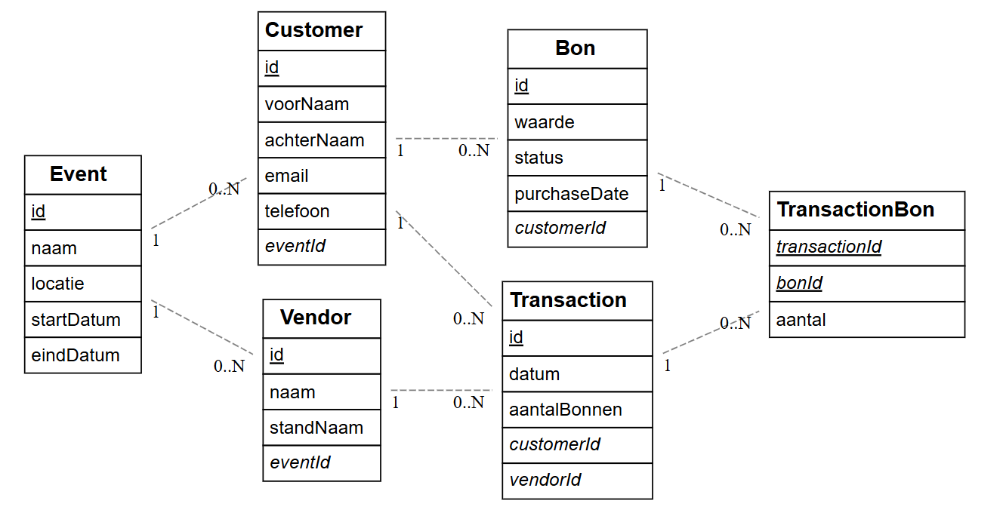

# H2 oefeningen

## Stap 1: ontwerp ERD
```
[Event] 
*id
name 
location 
startDate
endDate 

[Customer] 
*id 
firstname 
lastname 
email 
phonenumber 

[Wallet] 
*id 
value 
state 
createdAt
+customerId 
+eventId 

[Transaction] 
*id 
date 
amount 
+walletId 
+vendorId 

[Vendor] 
*id 
boothName
firstname 
lastname 
email 
phonenumber  

Event 1--* Wallet Customer 
1--* Wallet 
Wallet 1--* Transaction 
Verkoper 1--* Transaction
```

**Resultaat:**



## Stap 2: endpoints definiëren

# 🧩 API Endpoints — Coop On Project

## Events
| Method | Endpoint | Description |
|--------|-----------|--------------|
| GET | /api/events | Get all events |
| GET | /api/events/:id | Get one event by ID |
| POST | /api/events | Create a new event |
| PUT | /api/events/:id | Update an event |
| DELETE | /api/events/:id | Delete an event |

### Related
| Method | Endpoint | Description |
|--------|-----------|--------------|
| GET | /api/events/:id/wallets | Get all wallets for an event |
(| GET | /api/events/:id/customers | Get all customers registered for an event |)

---

## Customers
| Method | Endpoint | Description |
|--------|-----------|--------------|
| GET | /api/customers | Get all customers |
| GET | /api/customers/:id | Get one customer by ID |
| POST | /api/customers | Create a new customer |
| PUT | /api/customers/:id | Update customer info |
| DELETE | /api/customers/:id | Delete a customer |

### Related
| Method | Endpoint | Description |
|--------|-----------|--------------|
| GET | /api/customers/:id/wallets | Get all wallets belonging to this customer |

---

## Wallets
| Method | Endpoint | Description |
|--------|-----------|--------------|
| GET | /api/wallets | Get all wallets |
| GET | /api/wallets/:id | Get one wallet by ID |
| POST | /api/wallets | Create a new wallet (requires `customerId` + `eventId`) |
| PUT | /api/wallets/:id | Update wallet (e.g. state or value) |
| DELETE | /api/wallets/:id | Delete a wallet |
| GET | /api/wallets/:id/transactions | Get all transactions for a wallet |
| POST | /api/wallets/:id/transactions | Create a transaction (spend or receive) |

---

## Transactions
| Method | Endpoint | Description |
|--------|-----------|--------------|
| GET | /api/transactions | Get all transactions |
| GET | /api/transactions/:id | Get one transaction by ID |
| POST | /api/transactions | Create a transaction (requires `walletId` + `vendorId` + `amount`) |
| PUT | /api/transactions/:id | Update a transaction (e.g. fix amount) |
| DELETE | /api/transactions/:id | Delete a transaction |

---

## Vendors
| Method | Endpoint | Description |
|--------|-----------|--------------|
| GET | /api/vendors | Get all vendors | 
| GET | /api/vendors/:id | Get one vendor by ID |
| POST | /api/vendors | Create a new vendor |
| PUT | /api/vendors/:id | Update vendor info |
| DELETE | /api/vendors/:id | Delete a vendor |
| GET | /api/vendors/:id/transactions | Get all transactions for a vendor |

---

# Extra functional endpoints (optioneel)
| Method | Endpoint | Description |
|--------|-----------|--------------|
| POST | /api/wallets/:id/topup | Add tokens to a wallet (amount > 0) |
| POST | /api/wallets/:id/spend | Spend tokens (amount < 0) |
| GET | /api/events/:id/summary | Get event summary (total wallets, total tokens, etc.) |
| GET | /api/vendors/:id/summary | Get vendor earnings summary |


