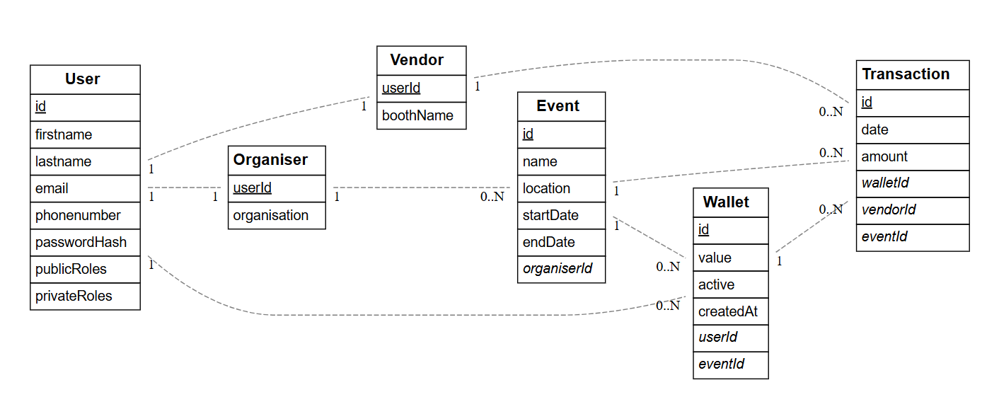

# Dossier

- Student: Jonas Slenders
- Studentennummer: 2023395591
- E-mailadres: <jonas.slenders@student.hogent.be>
- Demo: 
- GitHub-repository: <https://github.com/HOGENT-frontendweb/frontendweb-2526-slendersjonas>
- Web Services:
  - Online versie: <https://frontendweb-2526-slendersjonas.onrender.com/docs#/>

## 🔐 Logingegevens

### Lokale omgeving

#### Administrator (Super User)
- **E-mailadres**: `admin@coop-on.be`
- **Wachtwoord**: `12345678`
- **Rol**: Admin (Beschikt ook over Vendor, Organiser en Customer rechten)

#### Organiser (Evenementen organisator)
- **E-mailadres**: `frank@pukkelpop.be`
- **Wachtwoord**: `12345678`
- **Rol**: Organiser (User)

#### Vendor (Standhouder)
- **E-mailadres**: `pieter@pintje.be`
- **Wachtwoord**: `12345678`
- **Rol**: Vendor (User)

#### Customer (Bezoeker/Klant)
- **E-mailadres**: `janjanssen@gmail.com`
- **Wachtwoord**: `12345678`
- **Rol**: Customer (User)

### Online omgeving

De inloggegevens voor de online omgeving zijn identiek aan de lokale omgeving, aangezien dezelfde seed-data wordt gebruikt.

- **E-mailadres**: `admin@coop-on.be`
- **Wachtwoord**: `12345678`
- **Rol**: Admin

## 📖 Projectbeschrijving

> **Instructie:** Beschrijf hier duidelijk en beknopt waarover jouw project gaat. Wat is het doel? Wie is de doelgroep? Welke functionaliteiten biedt het?

Mijn project is de back-end applicatie voor een cashless betaalsysteem gericht op evenementen en festivals. De applicatie fungeert als de centrale 'bank' en het beheersysteem voor organisatoren, standhouders en bezoekers.

Het doel van de applicatie is het digitaliseren van de traditionele "drankbonnetjes" of munten. Door gebruik te maken van digitale wallets worden wachtrijen verkort, is er minder cashgeld in omloop en krijgen organisatoren real-time inzicht in de geldstromen.

> **Instructie:** Voeg hier een afbeelding van jouw ERD toe en licht de belangrijkste entiteiten en relaties kort toe.

* **Gebruikersbeheer (User, Vendor, Organiser):**
  De tabel `User` is de centrale entiteit die alle inloggegevens en basisinformatie bevat. Er is gekozen voor een **1-op-1 relatie** naar   `Vendor` (standhouder) en `Organiser` (organisator). Dit betekent dat een gebruiker specifieke eigenschappen kan hebben (zoals een    standnaam of organisatienaam) afhankelijk van hun rol, zonder de hoofdtabel te vervuilen.

* **Evenementenstructuur (Organiser & Event):**
  Een `Organiser` kan meerdere evenementen beheren (**1-op-N relatie**). Elk `Event` is dus altijd gekoppeld aan één verantwoordelijke organisator en bevat de specifieke data (locatie, start- en einddatum).
* **Wallet Systeem (User, Event & Wallet):**
  De `Wallet` fungeert als de koppeltabel tussen een `User` en een `Event`. Een gebruiker heeft per evenement een unieke wallet (**1-op-N relatie** vanuit User en Event). Hierin wordt het actuele saldo (`value`) en de status (`active`) bijgehouden.
* **Transacties (Transaction):**
  Dit is het logboek van het systeem. Een `Transaction` legt een betaling vast en verbindt drie entiteiten: de `Wallet` (de betaler/bezoeker), de `Vendor` (de ontvanger/standhouder) en het `Event` (de context). Hierdoor is altijd traceerbaar wie, hoeveel, aan wie en waar heeft betaald.

## ✅ Ontvankelijkheidscriteria

- [ ] Het project van Web Services voldoet aan **alle** ontvankelijkheidscriteria zoals beschreven in de rubrics.

## 🚀 Extra technologieën

> **Instructie:** Beschrijf welke extra technologieën je hebt gebruikt. Vermeld waarom je deze hebt gekozen.

### Web Services

- https://www.npmjs.com/package/stripe

  * **Stripe API Client:** Ik heb gekozen voor Stripe om de waarde van mijn wallets op te kunnen waarderen met "fysiek" geld.

## 🤔 Reflectie

> **Instructie:** Reflecteer eerlijk over je leerproces en het project. Dit helpt zowel jezelf als de docenten om de cursus te verbeteren.

**Wat heb je geleerd?**

  Ik vond dit een super interessante opdracht. Ik heb geleerd hoe ik een API kan bouwen als back-end voor een applicatie.

**Wat vond je goed aan dit project?**

  Ik vond dit een super fijne opdracht om aan te werken. Er is redelijk veel tijd ingekropen omdat het naar mijn gevoel een complexe applicatie is. Maar ik heb een begin gemaakt voor iets wat ik hopelijk verder kan zetten.

**Wat zou je anders doen?**

  Achteraf gezien zou ik het project minder complex gemaakt hebben omdat ik er wel heel veel tijd in gestoken heb.

**Wat waren de grootste uitdagingen?**

  Het project afkrijgen in het algemeen. En niet goed weten hoe ik mijn endpoints moest definiëren.

**Wat zou je behouden aan de cursus?**

  Over het algemeen vond ik de cursus meer dan voldoende om de opdracht afgewerkt te krijgen

**Wat zou je toevoegen/aanpassen?**

  Een beter beschrijving waar je welke endpoint moet gebruiken.

